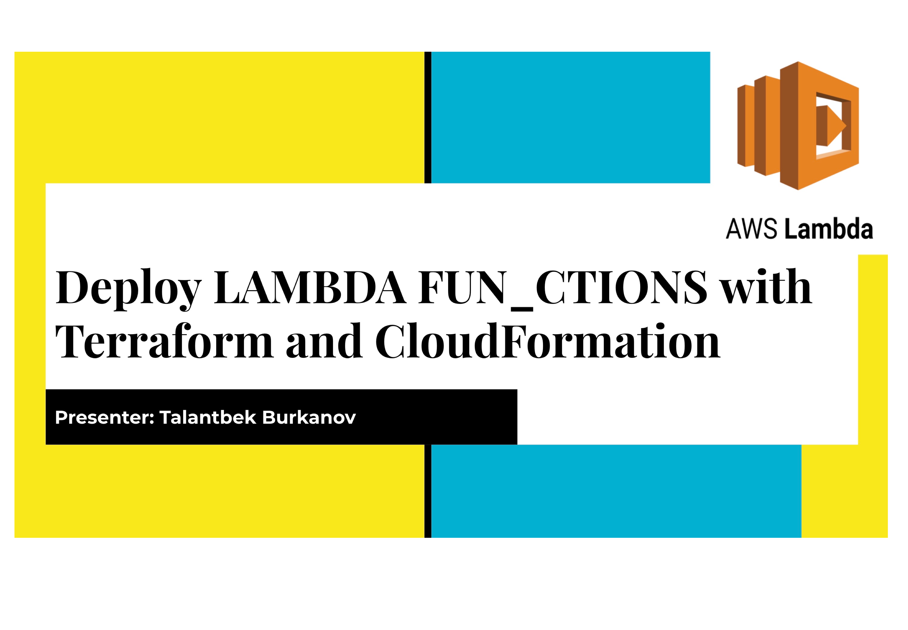
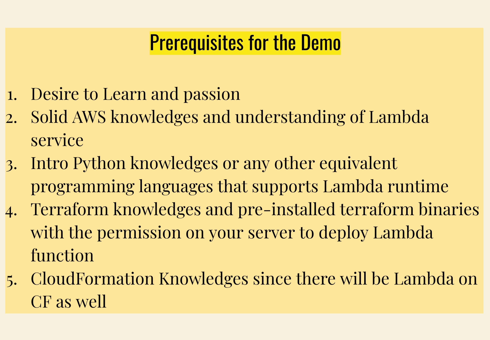
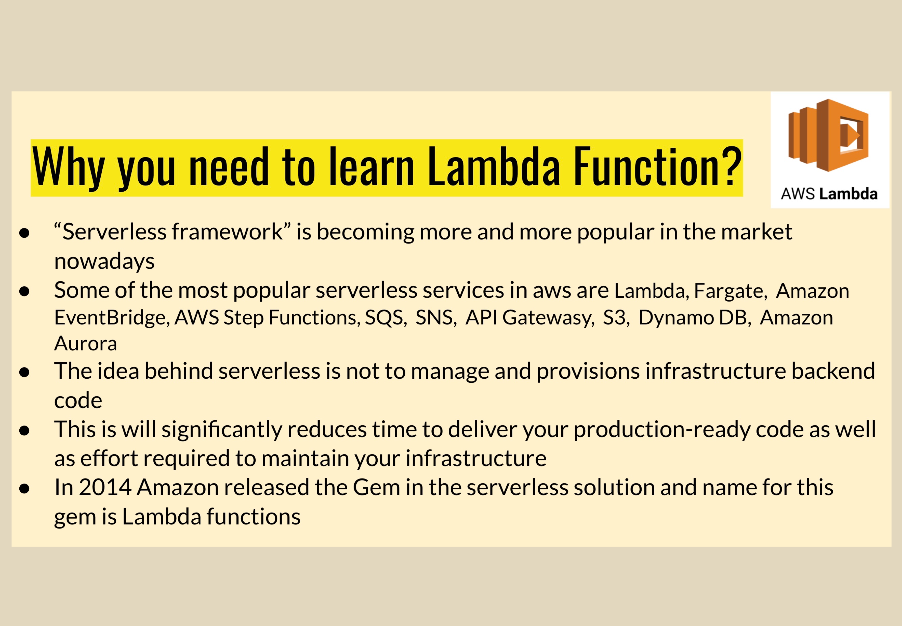
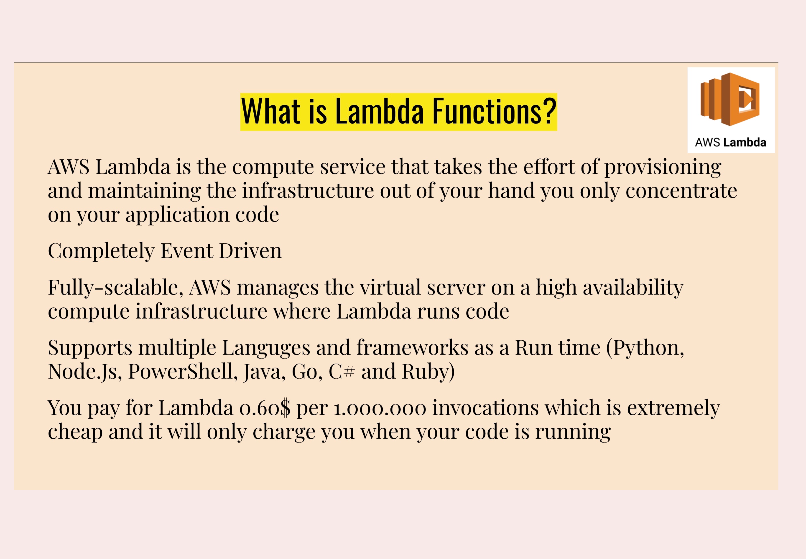
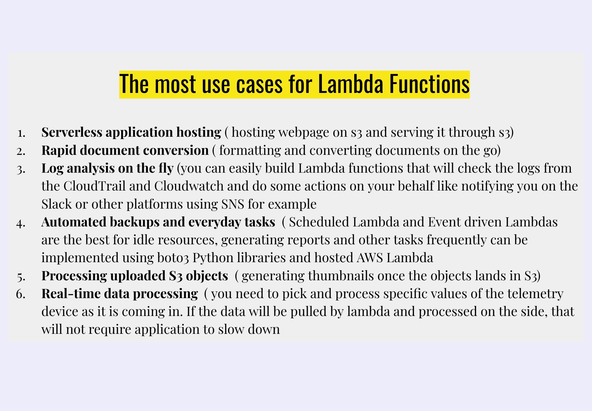
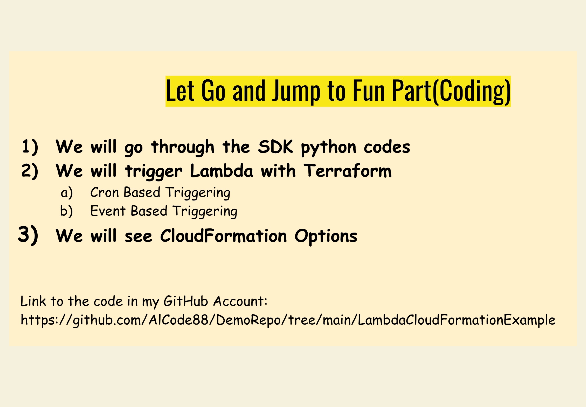
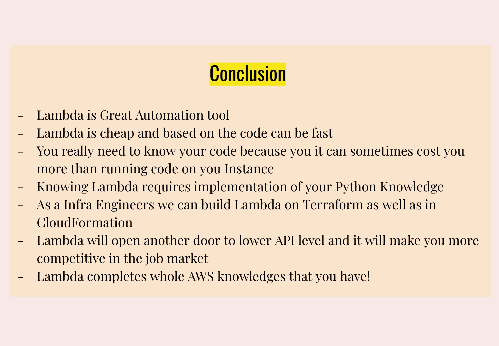

# Lambda Functions with Terraform and CloudFormation











## Python3.7 and Boto3 Installation
 Install Python3.x and Boto3 on Linux Server
By default if you installing Amazon Linux, you will get default python version which you do not need to disturb existing Python.

Installing another Python version on your Amazon Linux
1)  Check what default Python version do you have! 
`python --version` and for the python3.7 `python3.7 --version`
If you have Python 2.7 then our requirement is to install python 3.7
2)  Switch to Root 
`sudo su` 
```
yum install gcc openssl-devel bzip2-devel libffi-devel
cd /usr/src
wget https://www.python.org/ftp/python/3.7.4/Python-3.7.4.tgz
tar xzf Python-3.7.4.tgz
cd Python-3.7.4
./configure --enable-optimizations
make altinstall
cd /usr/local/bin/
./python3.7 --version
./pip3.7 --version
pwd
ln -s /usr/local/bin/python3.7 /bin/python3
python3 --versio
ln -s /usr/local/bin/pip3.7 /bin/pip3
pip3 --version
pip3 install boto3
```

Link to install Python3 [How To Install Python 3.7 on CentOS/RHEL 7 & Fedora 34/33](https://tecadmin.net/install-python-3-7-on-centos/)

## Custom Session Configurations
Profile Name can be anything BotoLambdaDemo and you have to configure Access Keys, Secret Keys, region and format -json. <br> - Custom Session
`aws configure --profile BotoLambdaDemo` <br> - To check the keys you can run `cat .aws/credentials`  <br> - To check the profile name you can run `cat .aws/config` 

## Install Terraform on Amazon Linux
1. Install yum-config-manager to manage your repositories
`sudo yum install -y yum-utils`
2. Use yum-config-manager to add the official HashiCorp Linux repository.
`sudo yum-config-manager --add-repo https://rpm.releases.hashicorp.com/AmazonLinux/hashicorp.repo`
3. Install
`sudo yum -y install terraform`

